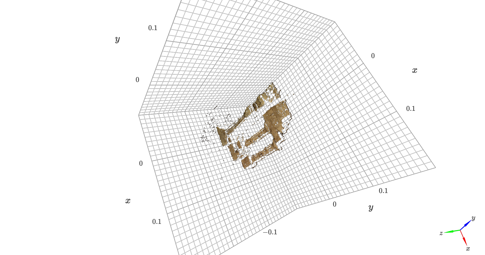
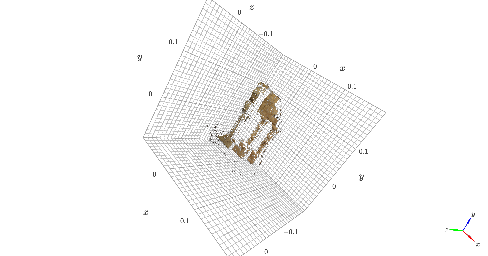
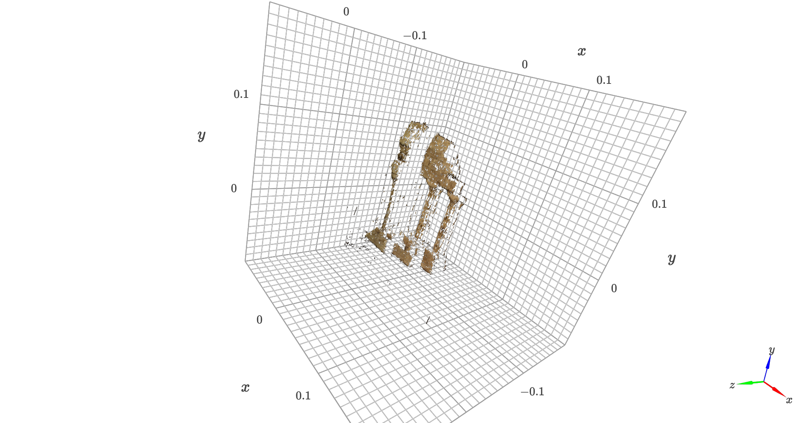
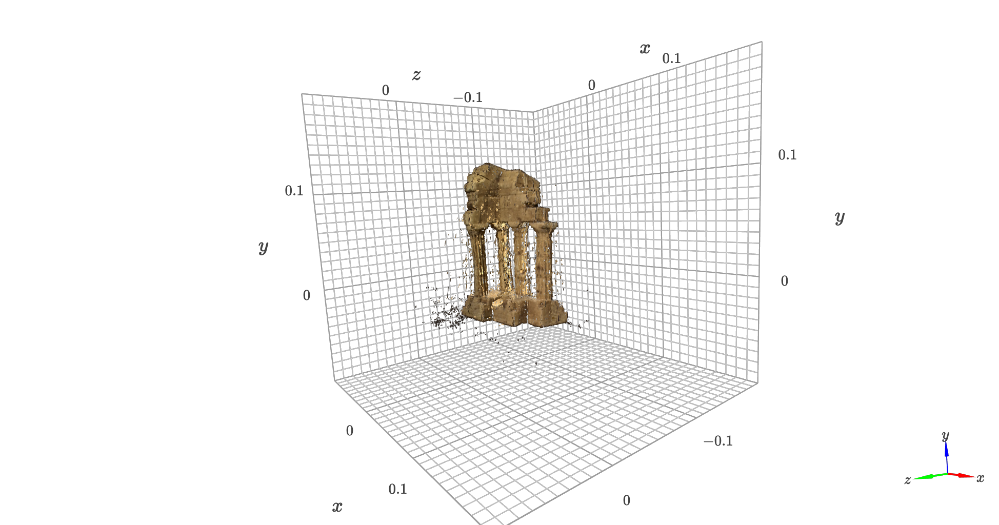

# Implementation of plane stereo and multiview stereo algorithm

The repo contains the implementation of multi view and plane stereo reconstruction algorithms from scratch. For multi view stereo the plane sweep algorithm was selected. 

#### Two view stereo steps

- Rectify the views for simplygying the epipolar search line
- Compute disparity map using ssd,sad and zncc kernels
- Added LR consistency check for handling occlusion
- Reconstruction of the scene using disparity map and multi-pair aggregation

SSD

SAD

ZNCC

#### Multi view stereo 

- Sweeped a series of imaginary depth planes (in this example, fronto-parallel
with the reference view) across a range of candidate depths and project neighboring views onto
the imaginary depth plane and back onto the reference view via a computed collineation.
- Constructed the cost volume by repeating the aforementioned steps across each of
the depth planes to be swept over and stacking each resulting cost map along the depth axis.
-Reconstruction of the scene using obtained depth (argmin of cost map)

Cost volume visualisation

Multi view stereo reconstruction

